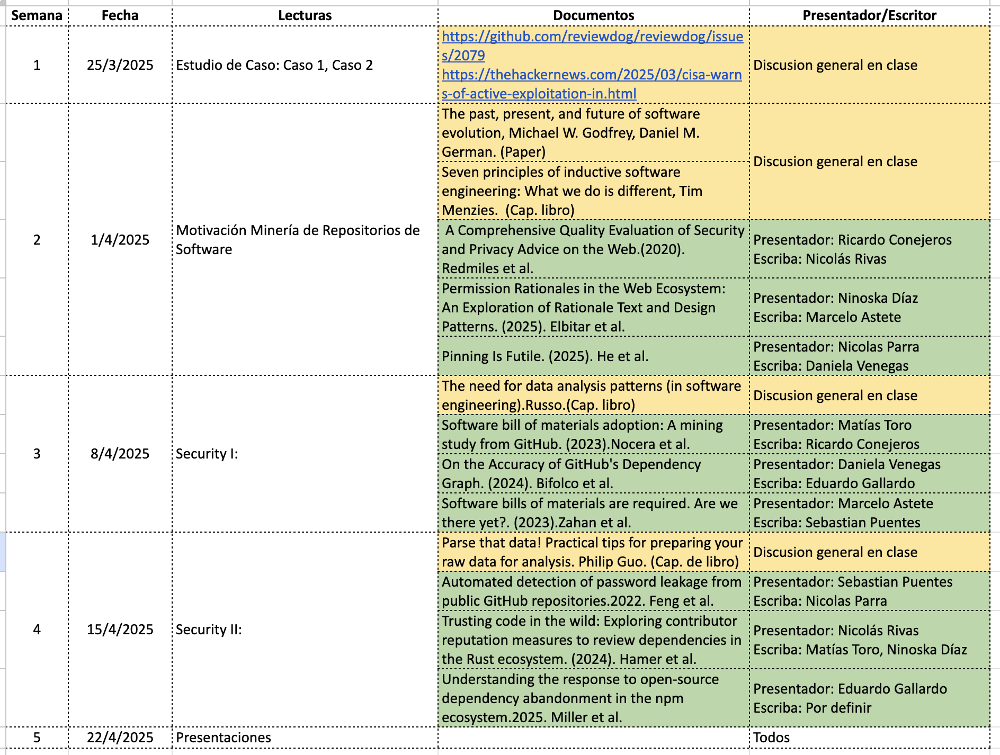

# IME310 - Calidad y Seguridad de Software
## Módulo 1: Minería de Repositorios de Software

# Planificación del Curso

[Calendario en google doc](https://docs.google.com/spreadsheets/d/1Rqg5dp994o54CCFSjvMt1g_CJWYKmfhg/edit?gid=1765228485#gid=1765228485)

 
---
- [Overview](organizacion/overview.md)
- [Libro del curso](organizacion/libro_del_curso.md)
- [Presentación de papers](organizacion/presentacion_de_papers.md)
- [Proyecto del curso](organizacion/proyecto_del_curso.md)
- [Revisión de papers](organizacion/revision_de_papers.md)
- [Dónde buscar papers](organizacion/donde_buscar_papers.md)
- [Esquema de evaluación](organizacion/esquema_de_evaluacion.md)
- [Documentos, libro y papers](documentos/)

